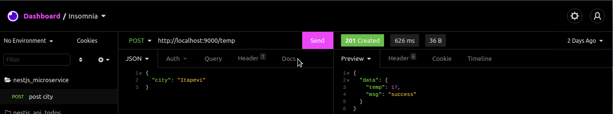

# ☁️ Microservice of weather

Api microservice created by nestjs with gateway and temp-celsius using weatherstack. 

## 💡 Project and endpoints

Import file called endpoints_collection_backend_books.json in your insomnia or postman.

<div align="center" >
  
</div>

## 🏃‍♂️ Run Locally

Clone the project

```bash
  git clone https://github.com/thurdelima/nestjs-simple-microservice-weather
```

Go to the project directory

```bash
 npm run start:dev in gateway and temp-celsius
```

Install dependencies

```bash
  npm install
```

Configure .ENV vars


<br/>

<h4 align="center">
  

Made with ♥   by Arthur Lima :wave: [Get in touch!](https://www.linkedin.com/in/arthur-lima-294ab0103/)
</h4>

